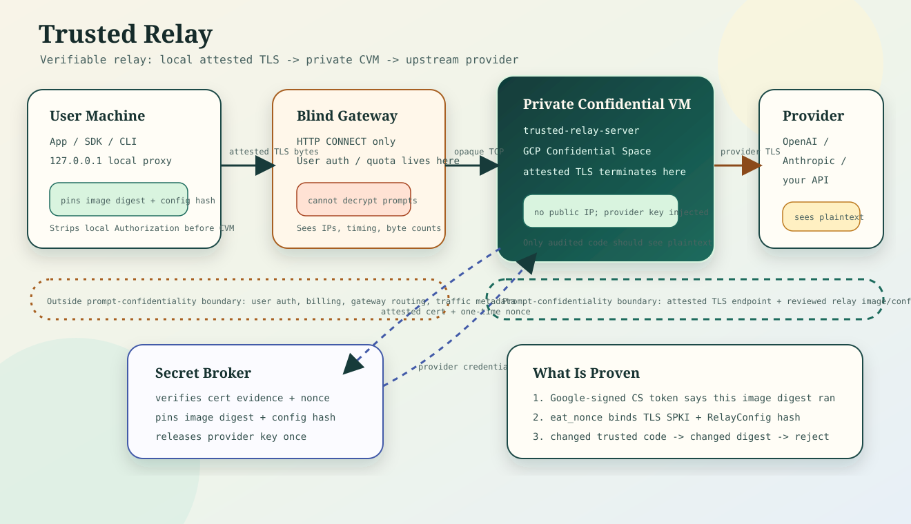

# Trusted Relay

A relay that tries to prove it is **not** reading your prompts in the boring old
"just trust us" way. The practical point is simple: if a middleman must exist,
the user should be able to verify the exact relay image/config before sending
anything sensitive. The less practical point is that this is fun, and it gives
CVM side-channel researchers a target that is not yet another unprotected AES
loop or ML kernel.



Trusted Relay is an OpenAI-compatible LLM API relay built around attested TLS.
The production path is **Google Cloud Confidential Space**: a user-side local
proxy verifies a Google-signed attestation token, pins the workload container
image digest or signature, checks the relay config hash, and only then sends
prompts through an encrypted channel that terminates inside the private CVM.

## Security Model

### What It Protects

- **Prompt/API traffic from the relay operator, gateway, cloud host, and network path.** They can route packets, enforce access, and count bytes, but they do not terminate the user-to-CVM attested TLS session.
- **Provider credentials from users and public gateways.** The provider key is injected into the private relay over a private admin path; local user tokens are stripped by `trusted-relay-local` before the relay connection.
- **Trusted-code drift.** A tiny compiled code change creates a new Confidential Space image digest, so clients pinned to the reviewed digest reject it before any prompt is forwarded.
- **Config drift.** `RelayConfig::config_hash()` is bound into the attestation nonce/reportdata, covering upstream allowlists, routing, limits, timeout, and release metadata.
- **TLS key substitution.** The attestation nonce/reportdata includes `SHA-384(TLS SPKI)`, so the accepted TLS private key must correspond to the attested certificate.

### What It Does Not Protect

- The upstream provider still receives plaintext. That is the point of using the provider.
- A malicious image that users choose to pin can still exfiltrate prompts. Pin reviewed releases, not vibes.
- Side channels, traffic analysis, DoS, compromised user machines, provider-side logging, and bugs in Google/AMD firmware remain out of scope.
- The gateway/control plane still sees user identity, IPs, timing, and byte counts.
- The relay's private admin injection path is operator scope. It is not part of the user's prompt-confidentiality proof; protect it with VPC/firewall/IAP/SSH controls.
- Raw GCP SEV-SNP `MEASUREMENT` alone is **not** used as the GCP workload identity here; our A/B test showed it did not change for custom image payload changes.

### Trust Roots

- **Google Confidential Space issuer:** `https://confidentialcomputing.googleapis.com` signs the attestation token.
- **Workload identity pin:** `submods.container.image_digest` and/or `submods.container.image_signatures` is checked by the local proxy and online checker.
- **Runtime safety pins:** `swname == CONFIDENTIAL_SPACE`, `dbgstat == disabled-since-boot`, `secboot == true`, plus optional service account, project, zone, and instance pins.
- **Attested TLS binding:** token nonces encode `SHA-384(TLS SPKI)[0..48] || RelayConfig::config_hash()[0..16]`.
- **Private injection boundary:** provider keys are runtime-only and enter through `POST /admin/provider-credential` on a private-only listener after launch.

## Components

- `trusted-relay-local`: local OpenAI-compatible proxy; verifies attestation and strips local `Authorization` before forwarding.
- `trusted-relay-gateway`: blind HTTP CONNECT gateway; authenticates users but never terminates attested TLS.
- `trusted-relay-server`: private CVM relay; terminates attested TLS, accepts one-shot private provider credential injection, and forwards only to allowed upstream providers.
- `trusted-relay-online-check`: live audit/strict verifier for real endpoints.

## Quick Start

### 1. Keep Secrets Out Of Git

```bash
cp .env.example .env
$EDITOR .env
set -a
. ./.env
set +a
```

`.env` is ignored. Put real `TRUSTED_RELAY_PROVIDER_TOKEN` and
`TRUSTED_RELAY_GATEWAY_TOKEN` only there or in a real secret manager. The repo
keeps `.env.example` as placeholders only.

### 2. Run Local Tests

```bash
cargo test --workspace --all-features
```

Useful focused checks:

```bash
cargo test -p trusted-relay-server --features tee-mock --test mock_e2e \
  private_admin_injection_loads_provider_credential_once
cargo test -p trusted-relay-local --features mock --test gateway_local_proxy
cargo test -p trusted-relay-local --features gcp-confidential-space --test gateway_local_proxy \
  local_proxy_rejects_changed_confidential_space_container_digest
```

### 3. Build And Push A Confidential Space Image

```bash
tools/gcp/build-confidential-space-image.sh \
  --project "$GCP_PROJECT" \
  --region "$GCP_REGION" \
  --repo trusted-relay
```

Record the printed `image_ref_with_digest` and `image_digest`, then update your
local `.env` pins.

### 4. Launch A Private Relay VM

```bash
tools/gcp/launch-confidential-space.sh \
  --project "$GCP_PROJECT" \
  --zone "$GCP_ZONE" \
  --name trusted-relay-cs \
  --image-ref "$IMAGE_REF_WITH_DIGEST" \
  --env TRUSTED_RELAY_UPSTREAM="$TRUSTED_RELAY_UPSTREAM" \
  --env TRUSTED_RELAY_ALLOWED_UPSTREAM="$TRUSTED_RELAY_ALLOWED_UPSTREAM" \
  --env TRUSTED_RELAY_RELEASE_ARTIFACT_DIGEST="${IMAGE_DIGEST#sha256:}" \
  --env TRUSTED_RELAY_ADMIN_LISTEN="0.0.0.0:8788" \
  --duration 2h
```

The VM has no public IP. Do **not** pass provider keys through image, metadata,
or launch env. Open `8443` only from the gateway/control subnet; open `8788`
only from the private operator service or a temporary private tunnel.

### 5. Inject Provider Credential Privately

From a host that can reach the VM private IP:

```bash
curl -fsS -X POST "http://RELAY_PRIVATE_IP:8788/admin/provider-credential" \
  -H 'content-type: application/json' \
  -d '{"auth_scheme":"Bearer","token":"'"$TRUSTED_RELAY_PROVIDER_TOKEN"'"}'
```

The injection endpoint is intentionally plain private HTTP: it is operator-scope
plumbing, not user-facing attested TLS. It accepts the credential once; a second
injection returns `409 Conflict`. If no credential is loaded, the relay fails
closed with `503 provider credential not loaded` rather than forwarding a user's
local `Authorization` to the upstream provider.

### 6. Run The Local Proxy

```bash
trusted-relay-local \
  --backend gcp-confidential-space \
  --relay-endpoint https://RELAY_PRIVATE_IP:8443 \
  --gateway-addr GATEWAY_PUBLIC_IP:443 \
  --expected-config-hash "$TRUSTED_RELAY_EXPECTED_CONFIG_HASH" \
  --gcp-cs-service-account "$TRUSTED_RELAY_GCP_CS_SERVICE_ACCOUNT" \
  --gcp-cs-project-id "$GCP_PROJECT" \
  --gcp-cs-zone "$GCP_ZONE" \
  --gcp-cs-image-digest "$TRUSTED_RELAY_GCP_CS_IMAGE_DIGEST"
```

Point local apps at:

```bash
OPENAI_BASE_URL=http://127.0.0.1:11434/v1
OPENAI_API_KEY=$TRUSTED_RELAY_LOCAL_TOKEN
```

## Real Release Test

The real negative test must be a trusted-code change, not just a wrong token:

1. Build image `A`, publish and pin its digest/config hash.
2. Verify a positive request through local proxy -> gateway -> private CVM -> provider.
3. Make a tiny compiled code change, build image `B`, and launch it.
4. Keep the local proxy and online checker pinned to `A`.
5. Expected result: attestation reaches Google token verification, then fails on `container.image_digest` mismatch; no prompt is forwarded.

See `docs/confidential-space.md` and `docs/real-online-test.md` for the detailed
GCP runbook and the May 22, 2026 A/B result.

## Project Layout

```text
assets/                    README architecture assets
build/confidential-space/  GCP Confidential Space container image
docs/                      Production architecture and online test runbooks
crates/relay-attest/       Mock, SEV-SNP, and GCP Confidential Space attestation
crates/relay-tls/          Attested TLS certificate generation and verifier
crates/relay-core/         Reverse proxy, routing config, allowlist, request limits
crates/relay-sdk/          Rust SDK and verification policies
server/                    trusted-relay-server
tools/local-proxy/         User-side local proxy
tools/gateway/             Blind CONNECT gateway
tools/online-check/        Live endpoint verifier
tools/gcp/                 Low-cost GCP build/launch/cleanup scripts
```

## Security Notes

- `.dockerignore` excludes `.env`, `.claude`, `.git`, `target`, and `.DS_Store` from container build context.
- `tee-mock` requires `TRUSTED_RELAY_DEV_MOCK=1` and is development-only.
- Strict production use requires workload identity pins and `expected_config_hash`.
- `TrustOnFirstUse` intentionally fails until persistent pinning is implemented.
- Request and response bodies are not logged; error logs redact token-like text.
- `tools/gcp/cleanup.sh` removes named throwaway GCP resources; still verify the cloud console before going to sleep.

## License

TODO: Choose license.
