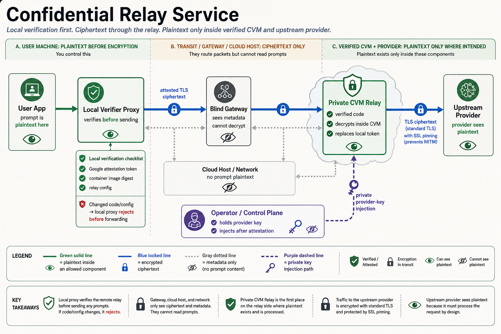

# Confidential Relay Service

Confidential Relay Service, packaged in this repo as `trusted-relay-*` tools, is
an OpenAI-compatible LLM relay that tries to make the claim "we cannot read your
prompts" slightly less hand-wavy.

Why build this?

- Because a relay should be able to prove what code and config it runs before it sees a prompt.
- Because "trust us bro" is a compliance strategy, not a security model.
- Because all those relays are definitely not reselling user data. Obviously. Never.
- Because it is fun.
- Because CVM side-channel researchers deserve a target that is not another naked AES loop or ML kernel.



## How It Works

This project is trying to make one narrow claim: the relay operator can sell a
relay service without being able to read or modify the user's prompt/response
stream between the local client and the selected upstream model provider.

- **Root of trust:** the user trusts the CPU TEE hardware, Google Confidential
  Space attestation, and the reviewed relay image/config pins, not the relay VM
  owner, VMM, gateway, or cloud network. See Google Confidential Space
  [overview](https://cloud.google.com/confidential-computing/confidential-space/docs/confidential-space-overview),
  Google Cloud [attestation](https://cloud.google.com/confidential-computing/docs/attestation),
  and AMD SEV-SNP [white paper](https://www.amd.com/content/dam/amd/en/documents/epyc-business-docs/white-papers/SEV-SNP-strengthening-vm-isolation-with-integrity-protection-and-more.pdf).
- **Workload identity:** Confidential Space issues a signed attestation token
  that includes container claims such as `container.image_digest` and optional
  image signature claims. The local proxy rejects the relay unless those claims
  match the pinned release. See Google Confidential Space
  [attestation token claims](https://cloud.google.com/confidential-computing/confidential-space/docs/reference/token-claims).
- **Runtime secrecy from the host:** the relay runs in a Confidential VM. AMD
  SEV-SNP encrypts guest memory and adds integrity protections against
  hypervisor attacks such as replay or memory remapping; the VMM should not be
  able to read or rewrite relay memory at runtime, modulo hardware/firmware bugs
  and side channels. See Google Confidential VM
  [overview](https://cloud.google.com/confidential-computing/confidential-vm/docs/confidential-vm-overview).
- **Attested TLS:** the CVM generates the TLS key inside the attested workload.
  The attestation nonce binds `SHA-384(TLS SPKI)` plus the relay
  `config_hash`, so the local proxy knows the TLS endpoint is the measured
  workload with the reviewed config, not a gateway MITM.
- **Gateway is blind:** the public gateway handles user auth, quota, billing,
  and CONNECT routing, but it only forwards encrypted bytes. It sees metadata
  like user identity, IPs, timing, and byte counts, not prompt plaintext.
- **Provider boundary:** the CVM replaces user auth with the operator's upstream
  provider credential, verifies the upstream provider's WebPKI/hostname and
  configured leaf-certificate pin, then sends the request. The upstream model
  provider sees plaintext because it is the intended recipient.

## Quick Start

### 1. Put Secrets In `.env`

```bash
cp .env.example .env
$EDITOR .env
set -a
. ./.env
set +a
```

`.env*` is ignored by git and Docker build context except `.env.example`. Put
real provider and gateway tokens only in `.env` or a real secret manager.

### 2. Run Local Tests

```bash
cargo test --workspace --all-features
```

Useful focused checks:

```bash
cargo test -p trusted-relay-server --features tee-mock --test mock_e2e \
  private_admin_injection_loads_provider_credential_once
cargo test -p trusted-relay-local --features mock --test gateway_local_proxy
cargo test -p trusted-relay-local --features gcp-confidential-space --test gateway_local_proxy \
  local_proxy_rejects_changed_confidential_space_container_digest
```

### 3. Build A Confidential Space Image

```bash
tools/gcp/build-confidential-space-image.sh \
  --project "$GCP_PROJECT" \
  --region "$GCP_REGION" \
  --repo trusted-relay \
  --require-pinned-bases \
  --rust-base "$TRUSTED_RELAY_RUST_BASE_IMAGE" \
  --runtime-base "$TRUSTED_RELAY_RUNTIME_BASE_IMAGE"
```

Record the printed `image_ref_with_digest` and `image_digest`, then update your
local pins.

### 4. Launch A Private Relay

```bash
tools/gcp/launch-confidential-space.sh \
  --project "$GCP_PROJECT" \
  --zone "$GCP_ZONE" \
  --name trusted-relay-cs \
  --service-account "$TRUSTED_RELAY_GCP_CS_SERVICE_ACCOUNT" \
  --image-ref "$IMAGE_REF_WITH_DIGEST" \
  --env TRUSTED_RELAY_UPSTREAM="$TRUSTED_RELAY_UPSTREAM" \
  --env TRUSTED_RELAY_ALLOWED_UPSTREAM="$TRUSTED_RELAY_ALLOWED_UPSTREAM" \
  --env TRUSTED_RELAY_UPSTREAM_TLS_LEAF_SHA256="$TRUSTED_RELAY_UPSTREAM_TLS_LEAF_SHA256" \
  --env TRUSTED_RELAY_RELEASE_ARTIFACT_DIGEST="${IMAGE_DIGEST#sha256:}" \
  --env TRUSTED_RELAY_ADMIN_LISTEN="0.0.0.0:8788" \
  --duration 2h
```

The VM has no public IP. Do not pass provider keys through image, metadata, or
launch env. Open `8443` only from gateway/control-plane paths and `8788` only
from private operator paths.

### 5. Inject Provider Credential

From a private host or temporary private tunnel:

```bash
curl -fsS -X POST "http://RELAY_PRIVATE_IP:8788/admin/provider-credential" \
  -H 'content-type: application/json' \
  -d '{"auth_scheme":"Bearer","token":"'"$TRUSTED_RELAY_PROVIDER_TOKEN"'"}'
```

The endpoint accepts one injection. Before injection, data-plane requests fail
closed with `503 provider credential not loaded`.

### 6. Run The Local Proxy

```bash
trusted-relay-local \
  --backend gcp-confidential-space \
  --relay-endpoint https://RELAY_PRIVATE_IP:8443 \
  --gateway-addr GATEWAY_PUBLIC_IP:443 \
  --expected-config-hash "$TRUSTED_RELAY_EXPECTED_CONFIG_HASH" \
  --gcp-cs-service-account "$TRUSTED_RELAY_GCP_CS_SERVICE_ACCOUNT" \
  --gcp-cs-project-id "$GCP_PROJECT" \
  --gcp-cs-zone "$GCP_ZONE" \
  --gcp-cs-image-digest "$TRUSTED_RELAY_GCP_CS_IMAGE_DIGEST"
```

Point local apps at:

```bash
OPENAI_BASE_URL=http://127.0.0.1:11434/v1
OPENAI_API_KEY=$TRUSTED_RELAY_LOCAL_TOKEN
```

## Status

This is an under-development research/prototype relay, not a polished hosted
product. Bug reports, hardening PRs, negative tests, deployment fixes, and
security reviews are very welcome.

Near-term work should add more upstream providers and more confidential-compute
backends, for example Anthropic/OpenAI-compatible providers plus AWS Nitro
Enclaves, Azure Confidential VMs, and other SEV-SNP/TDX platforms.

## What It Is

Trusted Relay has four moving parts:

- `trusted-relay-local`: a user-side local OpenAI-compatible proxy.
- `trusted-relay-gateway`: a blind HTTP CONNECT gateway for user auth, quota, and billing.
- `trusted-relay-server`: a private Confidential Space relay that terminates attested TLS.
- `trusted-relay-online-check`: a live endpoint verifier for release and smoke tests.

The production path uses **Google Cloud Confidential Space**. The local proxy
verifies a Google-signed attestation token, pins the workload image digest or
signature, checks the relay config hash, and only then forwards prompts over an
attested TLS session that terminates inside the private CVM.

## Security Model

### Protected

- **Prompt/API content from the relay service:** gateway, cloud host, network path, and relay operator do not terminate the attested TLS session.
- **Relay-side body logging:** the public gateway cannot decrypt prompt/response bodies, and the attested CVM code path does not log or persist request/response bodies.
- **Trusted code identity:** clients pin `submods.container.image_digest` or an image signature key.
- **Config identity:** `RelayConfig::config_hash()` covers runtime policy, upstream allowlists, routes, size limits, timeout, release metadata, and upstream TLS pins.
- **TLS endpoint binding:** attestation nonces bind `SHA-384(TLS SPKI)` to the attested certificate.
- **Upstream TLS pinning:** the CVM verifies normal WebPKI/hostname plus config-bound upstream leaf SHA-256 pins before sending request bytes.
- **Provider key separation:** users never receive the provider key; it is injected after CVM launch through a private admin path.

### Not Protected

- The upstream model provider, such as OpenAI or Anthropic, sees plaintext. That is the intended recipient of the request, not the relay operator.
- A malicious image that users deliberately pin can still exfiltrate prompts.
- Upstream provider logging, retention, training use, or employee access is governed by that provider; this project does not hide prompts from the selected upstream provider or verify its internal handling.
- Side channels, traffic analysis, DoS, compromised clients, and Google/AMD firmware bugs are out of scope.
- The gateway/control plane still sees user identity, IPs, timing, and byte counts.
- Provider-key injection is operator-scope plumbing, not user-facing attested TLS; protect it with VPC/firewall/IAP/SSH controls.

### Trust Roots

- Google Confidential Space issuer: `https://confidentialcomputing.googleapis.com`.
- Workload identity: `submods.container.image_digest` and/or `submods.container.image_signatures`.
- Runtime pins: `swname`, `dbgstat`, `secboot`, service account, project, zone, and optionally instance name.
- Attested TLS binding: `eat_nonce = SHA-384(SPKI)[0..48] || config_hash[0..16]`.

Raw GCP SEV-SNP `MEASUREMENT` is not the workload identity here; this project
uses Confidential Space container claims for GCP production.

## Real Release Test

A real release test must include both paths:

1. Positive: local proxy -> gateway/private tunnel -> Confidential Space relay -> upstream provider.
2. Negative: make a tiny compiled trusted-code change, build image `B`, keep clients pinned to image `A`, and confirm `container.image_digest` mismatch before forwarding.

See `docs/confidential-space.md` and `docs/real-online-test.md` for the detailed
GCP runbook, image-digest negative tests, and the May 22, 2026 final GCP E2E
with real OpenAI traffic plus upstream TLS leaf pinning.

## Project Layout

```text
assets/                    README architecture assets
build/confidential-space/  GCP Confidential Space container image
crates/relay-attest/       Mock, SEV-SNP, and GCP Confidential Space attestation
crates/relay-core/         Reverse proxy, config hash, allowlist, request limits
crates/relay-sdk/          Rust SDK and verification policies
crates/relay-tls/          Attested TLS certificate generation and verifier
docs/                      Architecture and real-test runbooks
server/                    trusted-relay-server
tools/gateway/             Blind CONNECT gateway
tools/gcp/                 Low-cost GCP build/launch/cleanup scripts
tools/local-proxy/         User-side local proxy
tools/online-check/        Live endpoint verifier
```

## Security Notes

- `tee-mock` requires `TRUSTED_RELAY_DEV_MOCK=1` and is development-only.
- Strict production use requires workload identity pins and `expected_config_hash`.
- Runtime policy (`allow_client_provider_auth`, private admin enabled, provider auth scheme, body logging policy) and upstream leaf certificate pins are included in `expected_config_hash`.
- Keep an upstream leaf-pin rotation set ready because public provider leaf certs can rotate.
- Release builds should use digest-pinned base images; see `docs/supply-chain.md`.
- `TrustOnFirstUse` intentionally fails until persistent pinning is implemented.
- In the relay-owned code path, request and response bodies are not logged; error logs redact token-like text.
- Injected-provider `401/403` bodies are sanitized before returning to local users.
- Run `tools/gcp/cleanup.sh` after throwaway tests and verify cloud resources are gone.
